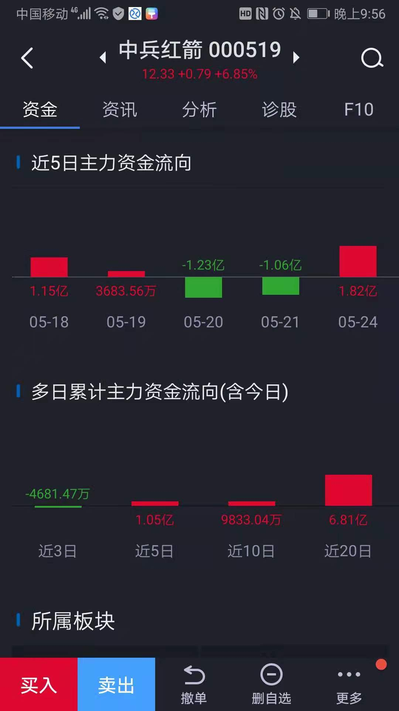
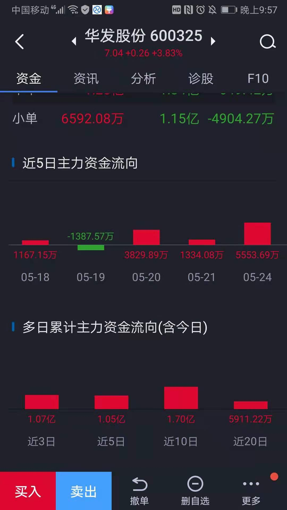
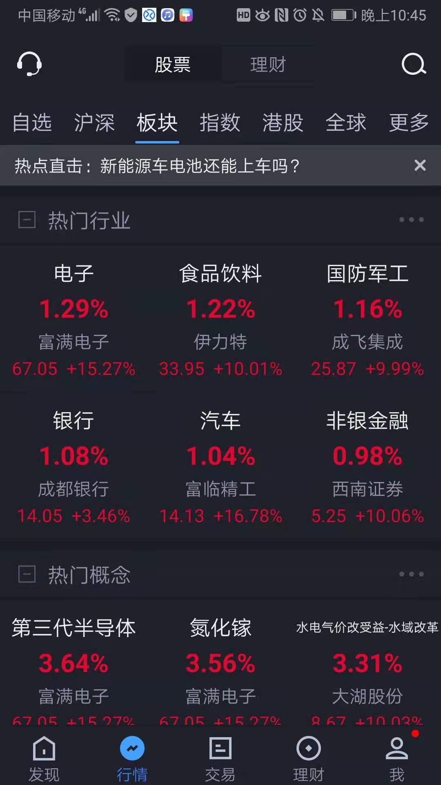
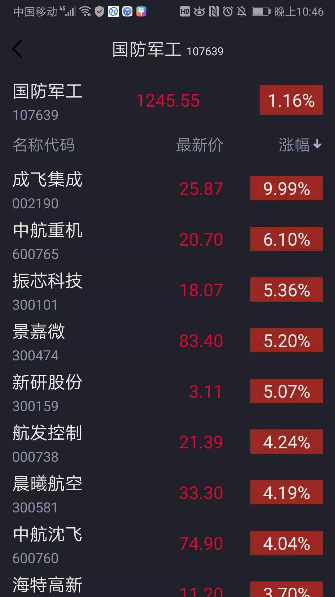
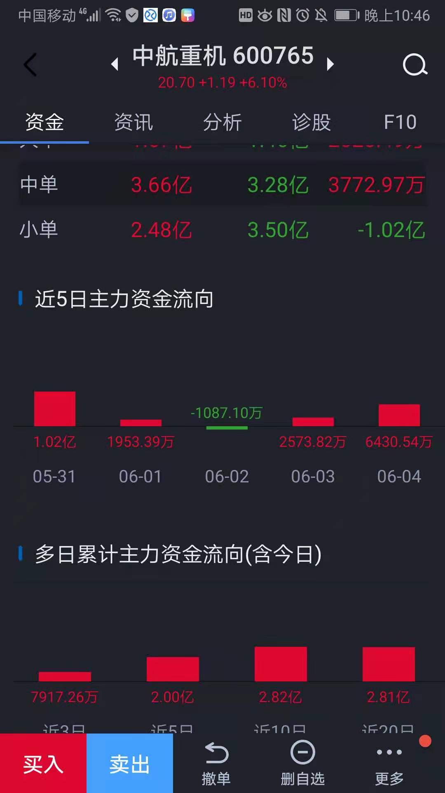
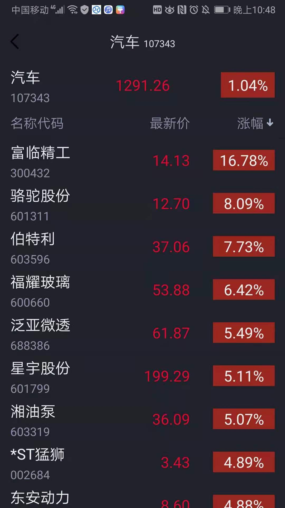
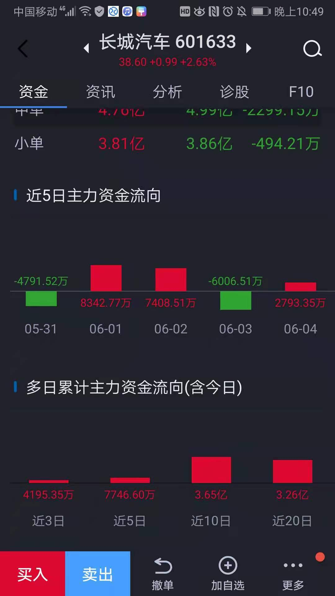

## 一、口诀

二次拉升战法：
大量资金铺在前；
横盘整理必要看；
只要资金不流出；
后续拉升可期盼；
调整结束第一阳；
把握买点是关键！

## 二、例子





```
今天的中兵红箭和华发股份都是二次拉升
有明显的资金铺在前面
露笑科技前面也是有明显资金铺在前面，现在在横盘整理
```


## 三、选择方法

### 1.强势板块


### 2.寻找强势个股



### 3.查看资金流入寻找符合规则的个股

