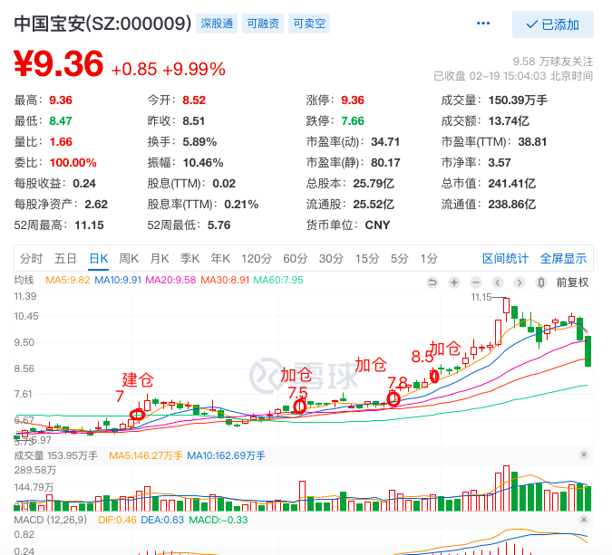

## 1-资金管理问题

1. 投资的首要目标是生存，先做到不亏大钱，在此基础上实现赚钱。股市的不确定性和随机性，要求我们必须进行仓位管理，控制风险，平抑账户波动。
2. 我们一开始分享的时候强调了切忌一次性重仓满仓一只股票
3. 切忌补仓处于下跌趋势的股票
4. 切忌在大盘还处于下跌趋势、有系统风险的时候开仓，学会耐心等待
5. 出现趋势破了，到止损点，严格坚决执行止损!

以上都是为了控制风险，仓位管理要根据战略天时、趋势进行顺势而为：起势开仓、得势加仓、势缓减仓、转势清仓、无势空仓。

***主要看上证指数和创业板指数当前的活动趋势，指数的趋势天时会严重影响个股的走势，所以要尊重市场敬畏市场，顺势而为。***


## 2-根据大盘天时进行总体仓位管理：

1、指数上升趋势的时候，5到8成仓，不满仓！

2、指数震荡趋势的时候，5成仓左右，不满仓！

3、指数下降趋势：1成仓～空仓

## 3-仓位、资金管理3+3+3法则

```
3条主线赛道+3只个股+3步建仓
一般把自己的资金分成10份，举例：10万或100万本金，分成3份3份3份1，
也就是单只个股不超过3成仓
一个账号持仓个股不超过3只
轻仓试仓+方向正确加仓+回踩确认加仓
加仓点包括：首次启动点买点和动量持续的买点

例如：

我选出了一只中长线价值股，
计划买10000股的话，
按照以下步骤进行

1、先买2000股，以试错的心态在买入！

2、如果账面出现盈利的话，在口袋支点加仓2000股


3、如果第一次加仓以后账面盈利几个点，进行第二次加仓2000股。此时我们已经买了计划的60%。

第三步，等市场的反应，如果继续上涨或者整理之后继续突破前高上涨的话，就可以把计划中剩下40%的全部买完。

```





#### 设置整数价格
比如：8块，9块，10块，8.5，8.6，8.8等数字价格，便于记忆


#### 建仓点：
是一个支撑点、关键点买点价位，具体战法、支撑点、形态都有做分享，加仓点也是一个动量持续的买点


#### 如果错过了第一买点，就等回调买点


<br/>
<br/>
<br/>

#### 利弗莫尔大师
百年美股第一人利弗莫尔大师到职业生涯巅峰的时候就是用的三步建仓法。先找到转折点、启动点，三步建仓，碾压了华尔街上所有的天才——第一步，空仓等待。等转折后启动点的到来，等成交量放大，等市场用它独有的语言解释机会的来临，第二步，捕捉到转折后启动点到来以后进行三步建仓法：轻仓试仓+方向正确加仓+回踩确认加仓


#### 致敬价值投资和趋势投资大师


### 4-翻倍股、10倍大牛股挖掘方法论

1、看业绩：业绩爆炸式增长。当年、次年的业绩倍增，100%+～1000%的增长

2、看估值：PEPB估值还很便宜，现阶段估值10～20倍之内

3、看地位：公司是行业龙头，或细分行业龙头；甚至全球龙头

4、看市值：中小市值，启动时市值最好在200亿以内

5、看形态：相对底部创新高上升趋势牛股初显象，肯定不是下降趋势


### Q1 估值泡沫大不大，从哪里能看到？
```
市值=利润*市盈率（估值）
市值=股份数*股价

利润*市盈率=股份数*股价

股份数在不增发的情况下，股份数长期固定的

股价涨来自

1、利润增长（长期）
2、市盈率涨（短期）


市盈率越大估值泡沫越大
市盈率越低安全边际越高
当然要结合利润增长的持续性、增长速度，还有赛道未来3年前景来看
```
