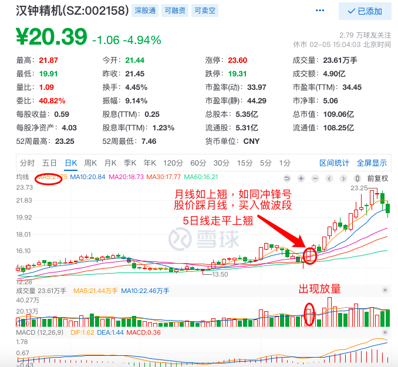

## 一 均线成交量
黄线代表5日价格均线，蓝色代表10日价格均线，软件不同颜色不同


软件上都有成交量的这个柱子, 通过柱子可以形象直观的看出成交量变化


## 二 1、精准买点关键点   2、精准止损关键点  3、精准的止盈关键点

战术里面：三个核心技术大家需要掌握  

1、价格 (K线形态、价格均线)  2、成交量  3、MACD


```
今天我重点分享一套简单以均线为核心买卖战法

均线战法：崇尚的交易方式，就是围绕均线做文章，最看重的均线，为5日、10日和20日3条均线，用60日均线来判断中期趋势的方向。60日线用于中线的趋势判断，长线的趋势判断，可以用250日均线来判断，也叫年线，也被称为牛熊线，站上且方向向上，则中长期趋势向上，重点用好5、10、20、60四条均线即可应付绝大多数情况，因为长江战法的投资买卖周期也是周、月为核心单位
```

### 2.1 接下来我分享的这个均线战法就是基于月线的战法（20日均线）
```
三句口号：
月线如上翘，犹如冲锋号，
月线如下行，波段已完成，
股价踩月线，买入作波段
```

月线如上翘，犹如冲锋号: 如图


### 2.2 5日线买入时间把握

***不能买两个原则：***
- 5日线处在高位不能买
- 向下运行时不能买

***可以买两个条件：***
- 5日线向下运行到较低位置，走平，刚刚拐头向上。
- 必须放量。股价出现阶段性地量之后，当天出现倍量以上

***必须卖两个条件：***
- 5日线向上运行到较高位置，走平，刚刚拐头向下。
- 必须缩量, 股价出现阶段性天量之后，当天出现较大缩量时。

### 2.3 20日均线战法买入战法更简单形象的讲：520战法

5日均线上穿20日均线的时候，伴随成交量放量，就买入

买入点把握如图:




### 2.4 止损法则总结有三种：
- 1、破前支撑止损
- 2、破均线法止损
- 3、10%比例止损法

大家可以采取后面两个法则，
记住：趋势坏了，到了止损点一定坚决，止损不拖。错了就认错

#### 2.4.1 均线战法的止盈卖出法则
- 1、出现5日均线走平，有向下趋势的时候，可以视情况轻度减点仓  
- 2、如：出现5日均线向下，破了5日均线，止盈1/2，或者2/3
- 3、如：破了10日均线，5日均线死叉10日均线，止盈剩下的1/2，1/3

例子如下:


# 三 近期大阳线关键法则，大阳线底部价作为止损点原则

```
大阳线底部价，操盘手大多数不会轻易让破.
所以很多时候股价回踩大阳线底部价，如果出现金针探底，往往是买点

如果破大阳线底部3天内不收回，就视为破了
```


