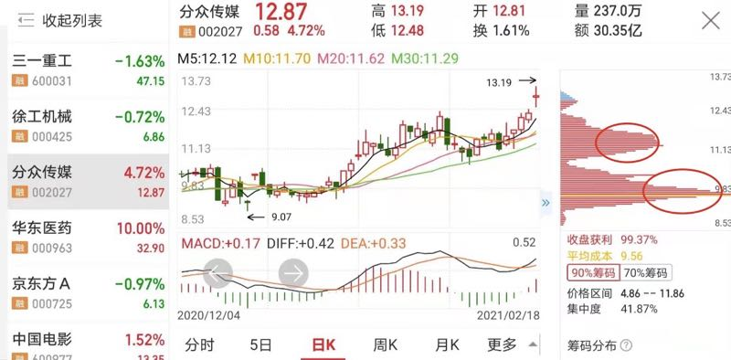

# 筹码分析

### 一．什么是筹码？
代表了所持有的股票
1.	峰值体现的是在这个位置股票所持有的数量或者占比
2.	不同的颜色代表了筹码在不同时期的建仓筹码（蓝色的代表了当前股票的套牢筹码、红色代表获利筹码）

### 二．筹码的形态

#### 1、单峰密集

说明股性活跃，如果是当前市场中热门题材，往往会有大幅拉升的行情！一旦个股拉高突破筹码密集区域，直接买入，因为这种情况大部分筹码都是获利，抛压较少，接力资金比较多

#### 2.、双峰密集
连续拉升的股票，在拉升过程中主力不断派发筹码，证明主力的底部筹码获利出局

#### 3.、多峰密集
表明主力资金仍然没有完成持仓的筹码派发，股价还会持续走高

### 三、筹码的使用技巧

#### 1、出现底部多峰密集形态，适合中长线买入

#### 2、股价向上突破单峰密集区域后，是中短线波段买入机会

#### 3.、上涨途中多峰密集形态，适合做中短线波段操作

#### 4、下峰锁定，行情未止！股价上涨过程中，如果底部筹码密集峰没有松动，说明市场持筹稳定，场内抛压不大，主力没有出货，还会持续性上涨。

这个位置的筹码还是呈现密集状态

如果出现稀少状态，就说明下面的筹码已经获利出了

我经常用这个看上方的筹码压力

 
 
 

上方套牢筹码稀少，上方就压力小

对比一下人民网和中国宝安就比较明显

这个位置的筹码还是呈现密集状态

中国宝安今天就比人民网上涨的轻松一些