# 成交量分析
```
股市本质，量价二字！
线下实体店生意的取决于人流量，互联网平台讲流量，成交量是最重要的股市指标，因为真金白银假不了
量价关系：就是成交量和价格涨跌之间的关系，是一个重要的指标，可用于波段性操作的买入与卖出，判断市场转折点等，属于技术指标的一种，而且是最关键的指标
短期的量价可以骗人，长期的量价关系则很难做出来
量价关系好比汽油和汽车的关系，没油的汽车是开不了的，油量充足，汽车才能远行，股价才能涨的多，但要区分汽车是前行还是原地打转。
量价之间的关系可分为六种形式：量增价跌、量增价平、量增价涨、量缩价跌、量缩价平、量缩价涨
还有六种特殊的情况：无量涨停（一字板），无量跌停，底部放量、地量地价、天量天价
```

### 一、量增价跌
量增价跌是指是指个股在股价下跌的情况下，成交量反而增加的一种量价配合现象，它意味着多、空双方意见发生较大的分岐，显示出空头占据了上风！

情形一：股价处于阶段性底部。量增价跌往往是空方继续发力的表现，它表明市场买卖者虽然发生了分岐，但空方力量较大，导致多方买盘力度不如空方卖盘力度，因而出现了量增价跌的现象。此类现象的出现，往往意味着真正的底部即将来临，只要尽一步消耗空方的能量，则会出现跌无可跌的现象，即地量地价的特殊情况，则往往意味着股价反转的拐点来临。

此时的量增价跌也说明，多方有出现接盘的动机，主力资金开始进场接盘，但还不是价格的阶段性底部

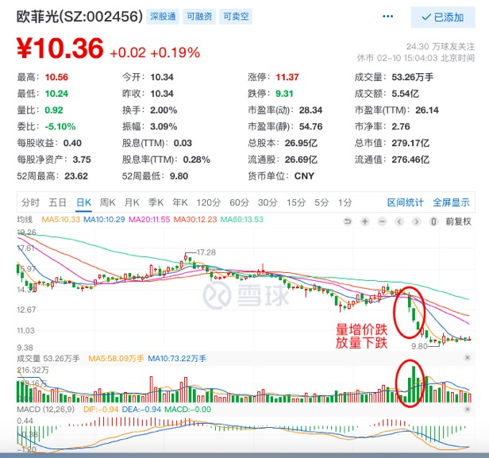

情形二：股价处于阶段性顶部。量增价跌说明主力开始出货了，空方加大了抛售的力度！由于前期股票价格的不断走高，吸引了众多不明真相的小散积极介入追涨模式，所以此时的成交量往往较前期出理放量！当空方机构开始出货后，股价必然会出现阶段性跌势。

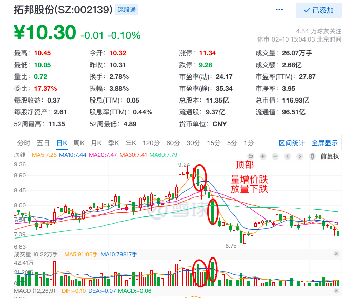

***高位放量就要跑，跑错也要跑！***

### 二、量增价平

量增价平是指成交量放大的情况下，股价维持在一定的价位水平上下波动。它意味着多、空双方意见分岐较大，没有出现绝对的控盘情况，此类现象往往出现横盘震荡。

情形一：股价处于阶段性底部。长期的量增价平，意味着多方开始进场的表现，主要为了吸收筹码！

由于处于建仓初期阶段，所以主力在吃货的速度并不明显，没有引起过多的涨幅。同时，也承接了空多的大部分抛单，导致成交量增大而价格不涨的现象。但这不意味着主力会迅速拉升，而是让股价长期一段时间在一个区间内横盘震荡！

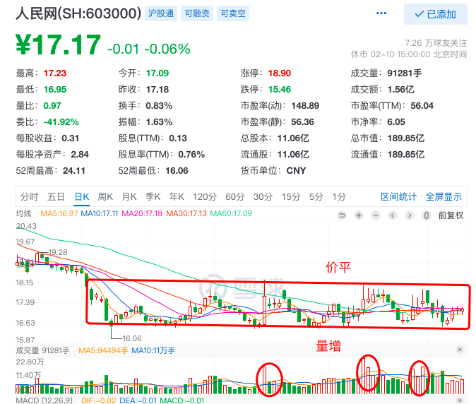

情形二：股价处于阶段性顶部。量增价平往往是空头开始发力的表现！

当股价有了较大的涨幅后，空方为了套现需要开始出货，而多方则热情依旧高涨乐于买入筹码，导致股票会出现成交量增大而价格没有大幅上扬的现象

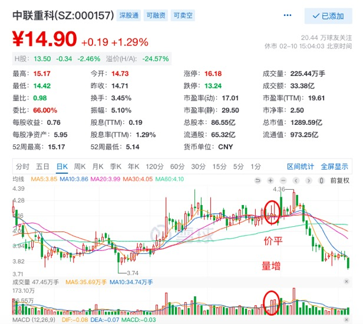

***放量不涨，头部将现！***

### 三、量增价涨
量增价涨是指个股在成交量增加的同时，股价也同步上涨的一种量价配合现象。意味着多、空双方意见发生较大的分岐，但多方仍占上风！

***低位放量就要跟，跟错也要跟！***

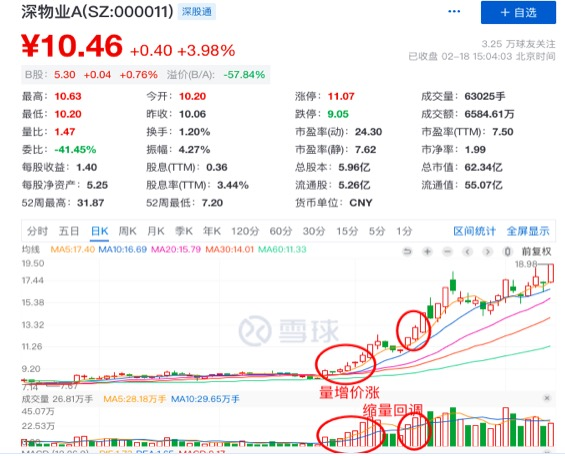

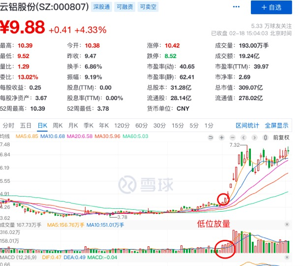


股价处于阶段性底部。量增价涨往往是是多方开始进攻，也是多方看好后期走势的表现。由于主力急需筹码而散户不看好后市，于是在价格一路上涨的情况下，中间伴随着缩量洗筹的过程，小散则急于交出筹码，从而再出现成交量增大而价格同步上涨的情况

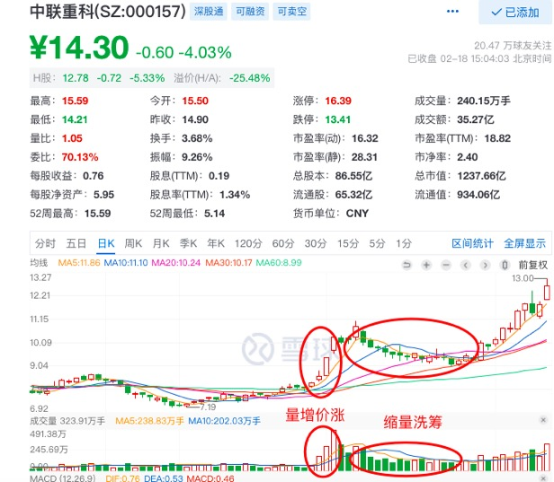

### 四、量缩价跌
量缩价跌是指个股在成交量减少的同时个股股价也同步下跌的一种量价配合的对象。它意味着多、空双方没有分岐，一致看跌，即接盘者很少

情形一：股价处于下跌趋势当中。此类情况表明，多、空双方集体看跌，抛者多，但却没有多少接盘者。出现此类情况，说明空方能量还没有得到释放，股价继续下跌的可能性很大，需要继续观察，等到价格明显放量的支撑下企稳为止。

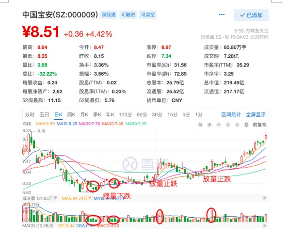

***这叫：缩量下跌，还将下跌！***


情形二：股价处于阶段性顶部。出现此类情况，说明个股已被主力高度控盘，不是主力不想卖，而是主力找不到人接盘。于是主力任由少量散户左右行情，或者见一个买家就往下面卖一点筹码，因此就出现了量缩价跌的现象

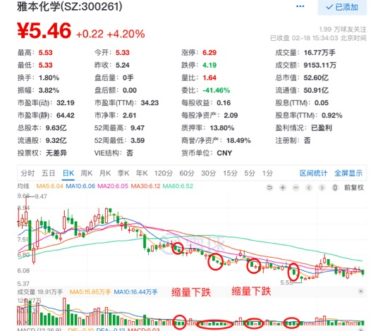

### 五、量缩价平

量缩价平是指股价少有涨跌幅度，但在交量却减少的情形。此类情形的出现，多为主力横盘洗筹以寻求股价支撑位！

情形一：股价处于阶段性底部。代表股价将继续往下探底，或是量已经见底将有机会反转。当出现股价止跌现象时，反弹的初期如果就呈现量缩价平的现象，代表涨势尚未确立，多头必须设法补量上攻，否则涨幅不会太大。谷底的量缩价还意味着另一层含义，即卖无可卖，有可能会发生反转。

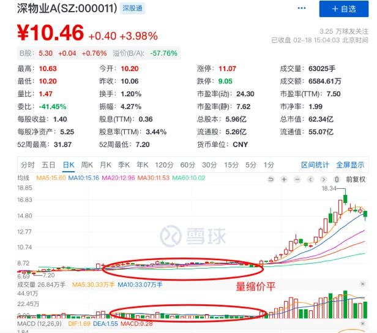

情形二：股价处于上升阶段形态。出现此类情形，主力机构要在合适的支撑处以量缩价平方式测试支撑位，支撑位测试可以均线为主！

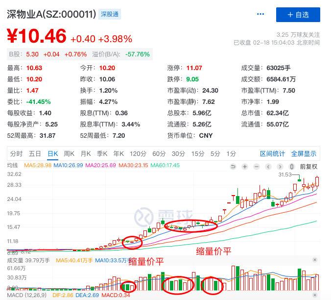

### 六、量缩价涨
量缩价涨是提个股在成交量减少的情况下，其股价出现较大涨幅的现象，它意味着多、空双方对后期上涨预期持意见一致的态度。

情形一：股价处于阶段性底部。量缩价涨说明多、空双方集体看涨，导致抛单不易出现！也可以说明筹码早集中在主力手中，主力已高度控盘，市面上流通筹码很少，主力只要轻轻一推，股价就开始上扬。这种现象较为少有，一般表现为量平价涨。

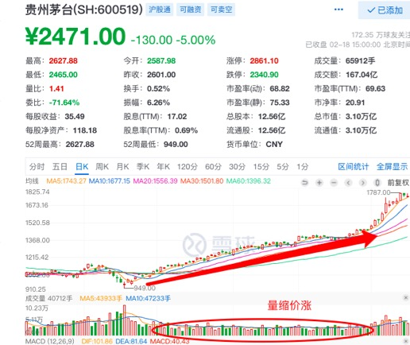

情形二：股价处于阶段性顶部。此类情形出现说明主力高度控盘，但不是主力不想卖，而是没有人愿意以这么高的价格接货，于是主力自己演戏，继续维持股票上涨。主力在此阶段的目的就是出货，不会放过任何一个接货的小散。

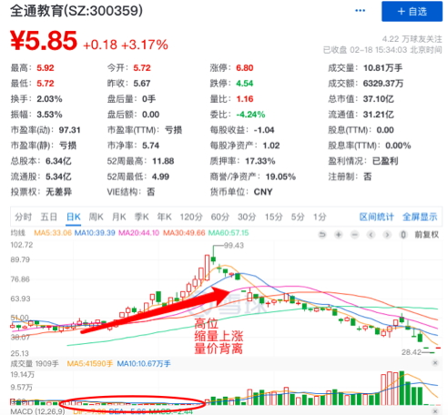

### 量比值和参考意义
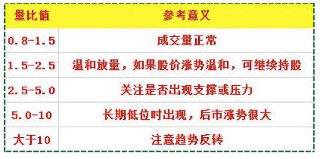


